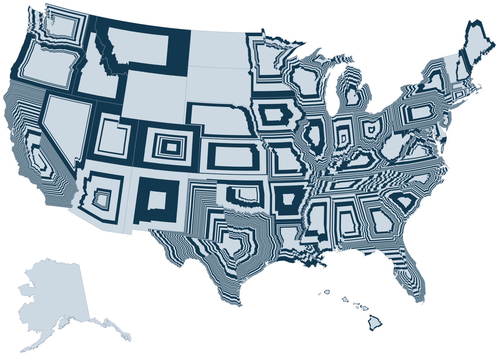
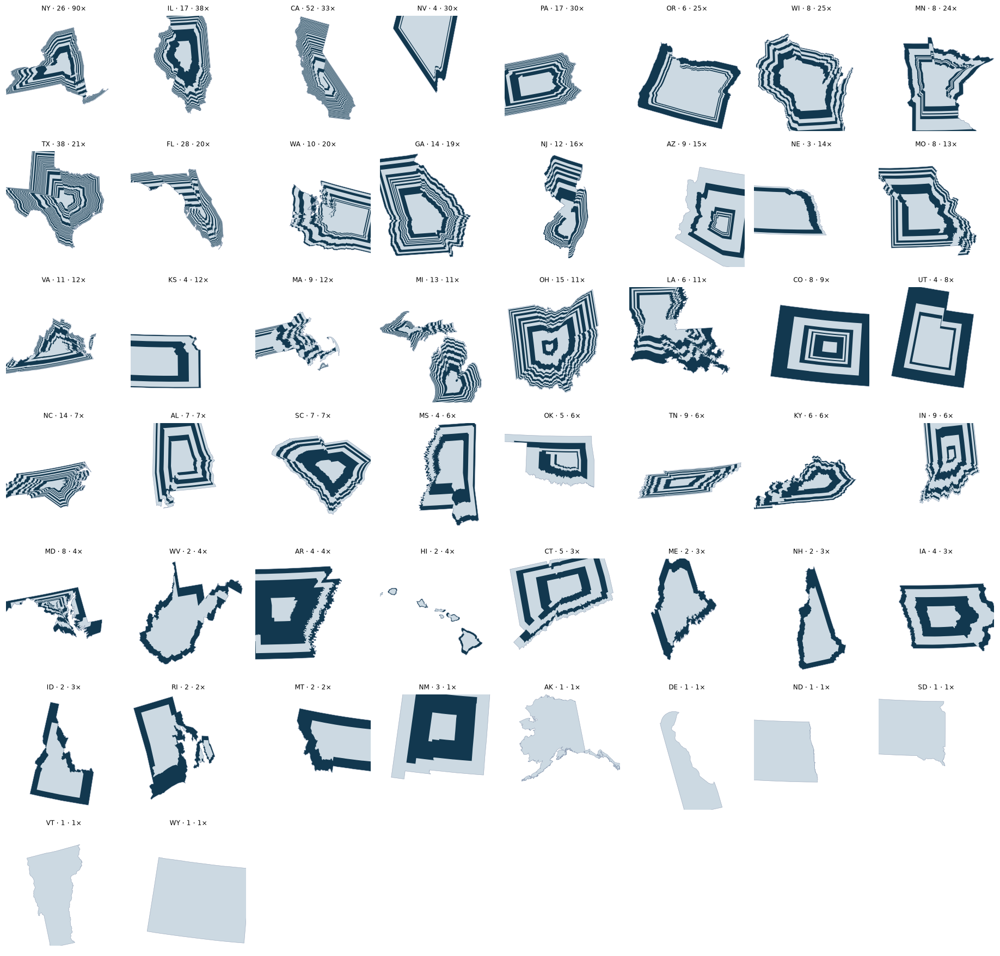
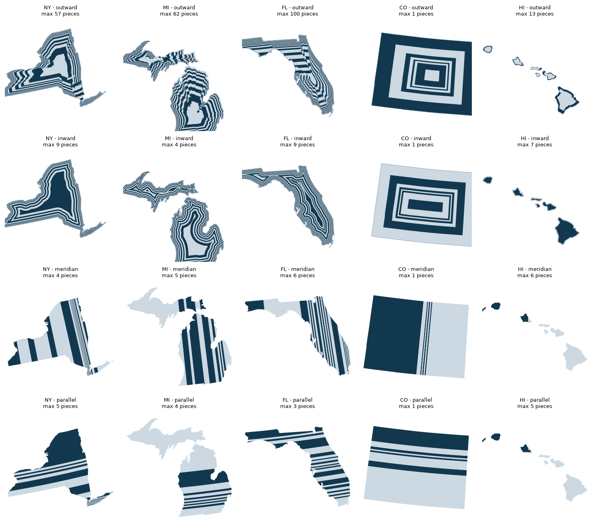

# Silhouette Districts

All 435 congressional districts redrawn so that **every district is the shape of
its own state**. District 1 is a solid scaled copy of the state centred on an
interior anchor; districts 2 through *n* are rings around it, each a larger copy
of the same outline. Every district holds an equal share of the state's 2020
census population.

A geometric thought experiment, not a redistricting proposal — and, it turns
out, one where only 115 of the 435 districts are a single connected piece.

Since then it has grown a second half. There are now **four** ways of walking
across a state while handing out equal shares of its population, run over the
same 2020 census blocks with the same checks.



---

## Live demo

[View on GitHub Pages](https://ssitari.github.io/SilhouetteDistricts/)

---

## What the map actually measures

The redistricting conceit is the hook. The thing on screen is a **radial
population-density profile**: ring width is inverse density, because every ring
holds the same number of people. Where a ring is thin, people are packed.

And because a state's geometric centre is almost never where its people live,
the result is lopsided in a way that carries the argument:

| State | Seats | Thickest ÷ thinnest ring | Density range (people/km²) |
|---|---|---|---|
| New York | 26 | **90×** | 37 → 632 |
| Illinois | 17 | 38× | 21 → 295 |
| California | 52 | 33× | 28 → 214 |
| Nevada | 4 | 30× | 5 → 68 |
| Texas | 38 | 21× | 16 → 83 |

New York's centre is rural; New York City is jammed into the far southeast
corner, so its outermost districts are filaments roughly one-ninetieth the width
of its innermost. Illinois does the same thing with Chicago, Nevada with Las
Vegas. Read across all fifty states, the map says that Americans live on the
edges of their states.

The six single-district states (**DE, AK, ND, SD, VT, WY**) come out solid,
which is correct: the district *is* the state.

The national map is the poster; the small-multiples view is the one that can
actually be read state by state, sorted by how lopsided each state is:



## The four models

| model | boundary | numbered from | contiguous | max pieces | worst pop dev |
|---|---|---|---|---|---|
| `outward` | scaled copy of the state | centre outward | 115/435 (26%) | 100 | 0.322% |
| `inward` | distance from the border | border inward | **344/435 (79%)** | 10 | 0.297% |
| `meridian` | a line of constant longitude | east to west | 313/435 (72%) | 10 | **0.189%** |
| `parallel` | a line of constant latitude | south to north | 322/435 (74%) | 10 | 0.382% |



The surprise is that **erosion beats both stripe models on contiguity.** Axis
aligned slabs feel like they ought to be the well-behaved ones, but a strip
crossing a state hits every island and peninsula on its line, while an erosion
collar wraps the boundary and stays whole.

Colorado reads the difference across all four at a glance: nested rectangles
holding their proportions, then flattening toward a bar, then Denver's Front
Range showing up as a tight cluster of vertical stripes or horizontal bands,
with the plains and the mountains each swallowing one very wide district.

The published site currently shows the `outward` model only.

### `inward` — erosion from the border

Every block is given its distance to the state boundary; sort, accumulate, cut.
District 1 is the outermost collar and the last district is whatever core
survives. Nesting is free here — erosion is monotone — and there is no anchor at
all, so the centroid problem disappears.

It costs the silhouette, which is the whole point of the outward model. Offsetting
strips an equal margin from every side, so the *shorter* dimension burns off
faster and a state flattens as it goes in. Colorado's aspect ratio holds at 1.27
at every depth under homothety and drifts 1.27 → 1.75 under erosion.

Use `join_style=round`, not mitre. Blocks are binned by Euclidean distance to the
border, and the set of points at distance ≥ d is by definition the erosion by a
**disk** — which is what a round join computes. Mitre is a different shape, so the
drawn bands would not match the distance bands the population came from. It also
collapses to empty at large offsets: Ohio's shells vanished at 120 km while its
deepest populated block sits at 148 km.

### `meridian` and `parallel` — the simple baselines

Sort every block on one coordinate, accumulate, cut. No anchor, no erosion, and
nothing to enforce: half-planes are disjoint and exhaustive, so the districts
partition the state by construction.

Cuts are made in **lon/lat**, so these are true meridians and parallels — which
means they are slightly curved when drawn on an Albers map, and the polygons are
segmentized at 0.02° before reprojection to keep that curve. Cutting in projected
metres instead would give lines that look perfectly straight on screen but are
not meridians.

## Method: the `outward` model

1. **Decompose** the state into *lobes* — polygon parts at or above 1% of state
   area. Most states have one. Michigan has two, Hawaii seven, and Virginia,
   Massachusetts and Rhode Island two apiece.
2. **Anchor** each lobe at its pole of inaccessibility (the interior point
   farthest from any edge). The plain centroid falls outside its own state often
   enough to matter. The anchor carries no analytical meaning — it exists so the
   nesting looks centred.
3. **Give every populated census block a radial coordinate** `s ∈ [0,1]`: the
   scale factor at which a copy of its lobe's outline, shrunk about the anchor,
   would pass through it.
4. **Sort all blocks in the state by `s`**, accumulate population, and cut at
   each *k/n* of the state total. Those cuts are the ring boundaries.

Because `s` is measured per lobe but sorted statewide, district *k* picks up a
ring from **every** lobe at the same relative radius — so Michigan's districts
come in two pieces and Hawaii's in seven, while staying equal-population
statewide. That one rule replaces what would otherwise be fifty hand-tuned
special cases.

### Why the farthest ray crossing

`s` is computed as the distance from the anchor divided by the anchor-to-boundary
distance along the same ray, taking the **farthest** crossing rather than the
nearest. That is what makes the method survive states that are not star-shaped
about their anchor — Idaho's panhandle, Oklahoma's, Maryland's. Every `s` stays
in [0,1] and the scaled outlines still nest.

The cost is that on a deeply concave lobe a shrunk copy can still cross the real
boundary. This is measured, not assumed, and reported per state as
`max_ring_escape_frac`:

| State | Max ring area outside its lobe |
|---|---|
| Maryland | 27.3% |
| Florida | 19.0% |
| Rhode Island | 16.9% |
| Louisiana | 7.1% |
| Massachusetts | 6.9% |

Maryland is the ugliest state on this map and it is worth knowing why: it is
the one whose outline least resembles a star about any interior point.

**Nothing is clipped in the web data.** The overhang is trimmed at render time
with an SVG `clipPath` on each lobe group. Boolean-clipping 435 rings would have
destroyed the payload; clipping the drawing group is exact and free. The GIS
export does materialise the rings — see below.

### These districts are mostly not contiguous

A ring around a *convex* state is one connected annulus. A ring around a concave
one severs wherever a district further in crosses it, and thin outer rings sever
repeatedly. Only **115 of 435** districts (26%) are a single connected piece.
Florida's worst is 100 fragments, Texas's 97, Virginia's 64.

This was the opposite of what I expected. A ring seemed like the one
conventional redistricting criterion this scheme would satisfy for free. It does
not, and the fragments are substantial rather than slivers — in Illinois's
outermost district the largest piece is only a fifth of the district.

## Accuracy

Population is assigned by **census block internal point** — the block is counted
whole, on whichever side of the ring boundary its point falls. The error scales
with *block radial extent ÷ ring width*, and those move together in our favour:
thin rings only occur where blocks are tiny, and huge rural blocks only sit
where rings are wide.

Worst district-population deviation across all 50 states: **0.32%** (Texas), or
about 2,400 people out of 762,000. Most states are under 0.1%.

## Running it

```bash
python -m venv .venv && .venv/bin/pip install shapely pyproj geopandas requests openpyxl matplotlib

python scripts/fetch_all.py                 # ~1.5 GB of PL 94-171, cached
python scripts/build_districts.py --all     # solve 50 states -> data/derived/
python scripts/bundle.py                    # merge + simplify -> data/districts.json
python scripts/preview_national.py          # optional PNG check
python scripts/fix_areas.py                 # exact ring areas (see below)
python scripts/export_gis.py                # GeoJSON -> data/gis/

# the other three models
python scripts/build_inward.py --all --gis
python scripts/build_stripes.py --mode meridian --all --gis
python scripts/build_stripes.py --mode parallel --all --gis
python scripts/preview_models.py NY MI FL CO HI
```

`build_inward.py` and `build_stripes.py` are far cheaper than the outward solve —
about two minutes for all fifty states each — because neither needs ray-casting.

Then serve the site over HTTP — it loads ES modules and data via `fetch()`, so
a `file://` URL will not work:

```bash
python -m http.server 8000
```

`config.js` holds every tunable: title, palette, credit, default view.
`app.js` is the engine.

## Five things that will cost you hours if you don't know them

**1. The three obvious population sources are all dead ends.** The Census API
(`api.census.gov/data/2020/dec/pl`) now requires a registered key. TIGER's
`tabblock20` layer carries block geometry but **no population field** — the
`POP20` everyone expects is not there. And there is no 2020 block gazetteer,
only tracts and coarser.

The **PL 94-171 geographic header** solves all three at once. It is keyless, it
is the authoritative redistricting product, and `POP100` sits in the *same
record* as the Census internal point (`INTPTLAT` / `INTPTLON`), so there is no
join at all. One ~10 MB zip per state.

**2. Use the cartographic boundary file, not TIGER, for state outlines.**
TIGER's state files carry water out to the three-mile limit and slice up the
Great Lakes, which would corrupt both the silhouette being scaled and the anchor
it is scaled about. `cb_2020_us_state_500k` is already shoreline-clipped.

**3. The apportionment sheet ends with a TOTAL row.** Parse it naively and you
get 51 "states" and 870 seats. `load_seats()` drops it and then asserts 50
states / 435 seats, because the entire map is a function of those numbers.

**4. Alaska and Hawaii cannot be solved in CONUS Albers.** Out there EPSG:5070
does not merely distort, it shears the outline into something that is not the
state's silhouette — which defeats the whole premise. Each gets its own
equal-area projection (`EPSG:3338`, and an Albers centred on 20.5N/157W). Mixing
CRSs across states is free here, because each state is drawn from its own
outline, anchor and scale factors, and the national layout insets them anyway.

**5. Simplify the outline *before* solving, not after.** Ray-casting cost is
linear in vertex count, and Michigan's `cb_500k` shoreline carries ~15,000 of
them: unsimplified it took 345 seconds, nearly all in the ray pass. At a 250 m
tolerance it takes 83 and the payload drops 5.6×, while ring escape moves
6.261% → 6.269% and population accuracy *improves*. Solving at full resolution
while drawing simplified would be the inconsistent choice, not this.

## The rendering trick

A district is never drawn as a ring. Each district *k* is drawn as a **solid**
copy of the outline scaled by `breaks[k]`, painted back to front from largest to
smallest. District *k−1* lands on top of district *k* and hides its middle, so
what survives on screen is the annulus — with no boolean geometry, no even-odd
paths, and one `<path>` per lobe reused by `<use>` for all 435 districts.

This is why the whole country fits in **0.84 MB**: the payload is fifty outlines
plus a table of scale factors, and the browser's `transform` does the rest.

Hit-testing falls out of the same trick. The topmost element under the pointer
is the smallest copy containing that point, which is exactly the district that
point belongs to. Re-filling that one element on hover repaints only the band,
because the inner copies still cover the rest.

There is no D3 and no projection code, because neither is needed once the
coordinates arrive pre-projected.

## GIS export

The web map never builds a ring — it paints solid scaled copies back to front
and lets z-order produce the annulus. `scripts/export_gis.py` materialises what
the map only implies, as real polygons in **EPSG:4326**:

```bash
python scripts/export_gis.py                    # all 50 states, one file
python scripts/export_gis.py --states IL MI HI --separate
python scripts/export_gis.py --crs EPSG:5070    # keep projected metres
```

Attributes per feature: `usps`, `state`, `district`, `seats`, `population`,
`area_km2`, `density_km2`, `s_inner`, `s_outer`, `ring_width`, `pieces`.

Districts 2..*n* export as polygons with interior rings; fragmented ones as
MultiPolygons. The result is a clean partition — measured pairwise overlap in
Illinois is 0.0086 km² out of 145,919, which is floating-point noise on shared
edges, and the parts sum exactly to the state.

**The national map's Alaska and Hawaii insets are a display transform and are
NOT applied.** Exported states sit at their true locations, so the layer will
not look like the map. That is correct.

If you need a state's outer boundary to coincide tightly with an authoritative
state border, re-solve just that state with `SOLVE_SIMPLIFY_M` lowered from 250 m
to ~25 m. Breakpoints shift by a hair; the map does not visibly change.

### The membership rule, and a bug it caused

A point belongs to the **smallest** *k* whose copy contains it — which is exactly
what back-to-front painting produces, since every smaller copy is drawn on top.
So each ring must subtract the union of *all* inner copies.

Subtracting only copy *k−1* is wrong for the same reason this project needs the
farthest ray crossing: on a concave lobe the copies are not monotonically
nested, so a piece of district 3 can sit outside copy 5, inside copy 6, and be
claimed by both. That double-covered 1.5% of Illinois before it was caught.

The same non-nesting broke the solver's original area calculation, which took
`A(copy_k) − A(copy_k−1)` and so over-subtracted by up to 12% (Maryland).
`scripts/fix_areas.py` rebuilds every ring by difference and measures it. Run it
after any full solve — it is the boolean pass only, not the ray-casting, so it
is quick.

## Outputs

| File | What it is |
|---|---|
| `data/districts.json` | The web payload — 50 states, 435 districts, 0.85 MB |
| `data/gis/districts.geojson` | All 435 districts as polygons, WGS84, 18.5 MB |
| `data/gis/XX_districts.geojson` | Per-state, with `--separate` |
| `data/derived/XX_districts.json` | Per-state solution: breaks, lobes, anchors, QA |
| `data/derived/summary.csv` | One row per state: ring ratio, density range, deviation, escape |
| `data/gis_inward/`, `gis_meridian/`, `gis_parallel/` | The other three models as GeoJSON |
| `data/derived_meridian/`, `derived_parallel/` | Cut longitudes / latitudes per state |

## Data sources and citations

> U.S. Census Bureau. *2020 Census Redistricting Data (P.L. 94-171) Summary
> File.* <https://www2.census.gov/programs-surveys/decennial/2020/data/01-Redistricting_File--PL_94-171/>

Block-level population (`POP100`) and internal points, read from the geographic
header. Public domain.

> U.S. Census Bureau. *Cartographic Boundary Files*, 2020 edition
> (`cb_2020_us_state_500k`). <https://www2.census.gov/geo/tiger/GENZ2020/shp/>

State outlines, 1:500,000, clipped to shoreline. Public domain.

> U.S. Census Bureau. *2020 Census Apportionment Results*, Table 1.
> <https://www2.census.gov/programs-surveys/decennial/2020/data/apportionment/>

Seats per state. Public domain.

Note the two population figures are different and both are correct: the
apportionment population (331,108,434) adds overseas federal employees and is
what the seat counts were computed from; the 50-state resident population
(330,759,736) is what this map distributes into rings.

### On gridded population surfaces

LandScan, GHS-POP, WorldPop and GPW were considered and deliberately not used.
For the 2020 United States they are **downscaled from the census**, not
independent of it, so they would add modelling error on top of the same counts —
and the census block is already the finer resolution, smaller than a 100 m cell
in urban areas. They earn their keep where a census is weak or absent. That is
not the US.

---

## Acknowledgements

Most of the code written with assistance from [Claude](https://claude.ai) (Anthropic).

---

## License

MIT — see `LICENSE`. That covers the code in this repository. The Census source
data is a work of the U.S. federal government and is in the public domain.
